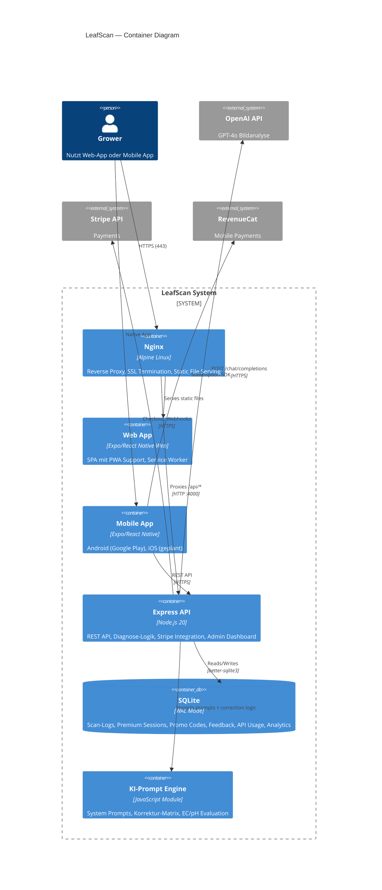

# Container Diagram (C4 Level 2)

> Zeigt die internen Container/Services von LeafScan.

```mermaid
C4Container
    title LeafScan — Container Diagram

    Person(user, "Grower", "Nutzt Web-App oder Mobile App")

    System_Boundary(leafscan, "LeafScan System") {
        Container(nginx, "Nginx", "Alpine Linux", "Reverse Proxy, SSL Termination, Static File Serving")
        Container(webapp, "Web App", "Expo/React Native Web", "SPA mit PWA Support, Service Worker")
        Container(mobileapp, "Mobile App", "Expo/React Native", "Android (Google Play), iOS (geplant)")
        Container(api, "Express API", "Node.js 20", "REST API, Diagnose-Logik, Stripe Integration, Admin Dashboard")
        ContainerDb(sqlite, "SQLite", "WAL Mode", "Scan-Logs, Premium Sessions, Promo Codes, Feedback, API Usage, Analytics")
        Container(prompts, "KI-Prompt Engine", "JavaScript Module", "System Prompts, Korrektur-Matrix, EC/pH Evaluation")
    }

    System_Ext(openai, "OpenAI API", "GPT-4o Bildanalyse")
    System_Ext(stripe, "Stripe API", "Payments")
    System_Ext(revenuecat, "RevenueCat", "Mobile Payments")

    Rel(user, nginx, "HTTPS (443)")
    Rel(user, mobileapp, "Native App")
    Rel(nginx, webapp, "Serves static files")
    Rel(nginx, api, "Proxies /api/*", "HTTP :4000")
    Rel(mobileapp, api, "REST API", "HTTPS")
    Rel(api, sqlite, "Reads/Writes", "better-sqlite3")
    Rel(api, prompts, "Imports prompts + correction logic")
    Rel(api, openai, "POST /chat/completions", "HTTPS")
    Rel(api, stripe, "Checkout, Webhooks", "HTTPS")
    Rel(mobileapp, revenuecat, "Subscription SDK")

    UpdateLayoutConfig($c4ShapeInRow="3", $c4BoundaryInRow="1")
```
