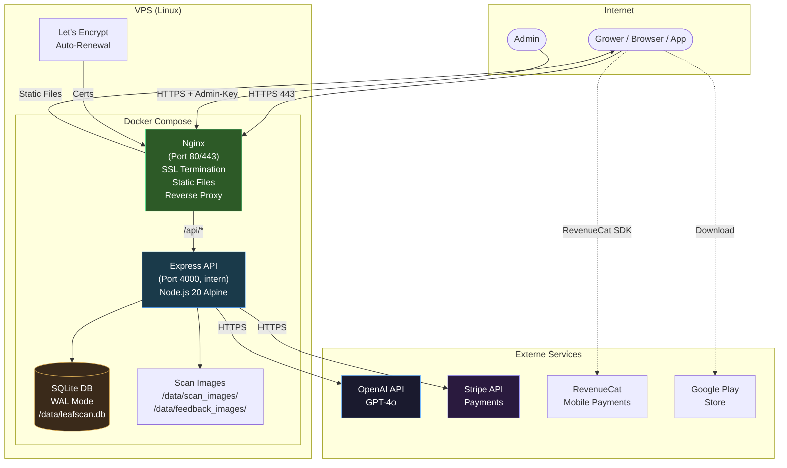

# Deployment Diagram

> Zeigt die Production-Infrastruktur von LeafScan.

## Ports & Services

| Service | Port | Extern | Beschreibung |
|---------|------|--------|-------------|
| Nginx | 80, 443 | Ja | HTTP→HTTPS Redirect, Static Files, API Proxy |
| Express API | 4000 | Nein (intern) | REST API, nur via Nginx erreichbar |
| SQLite | — | Nein | Embedded DB, kein Netzwerk-Port |

## Volumes

| Volume | Pfad | Inhalt |
|--------|------|--------|
| `leafscan-data` | `/app/server/data/` | SQLite DB, Scan-Images, Feedback-Images |
| SSL Certs | `/etc/letsencrypt/` | Let's Encrypt Zertifikate |

## DNS

| Record | Typ | Ziel |
|--------|-----|------|
| leafscan.de | A | VPS IP |
| www.leafscan.de | CNAME | leafscan.de |
