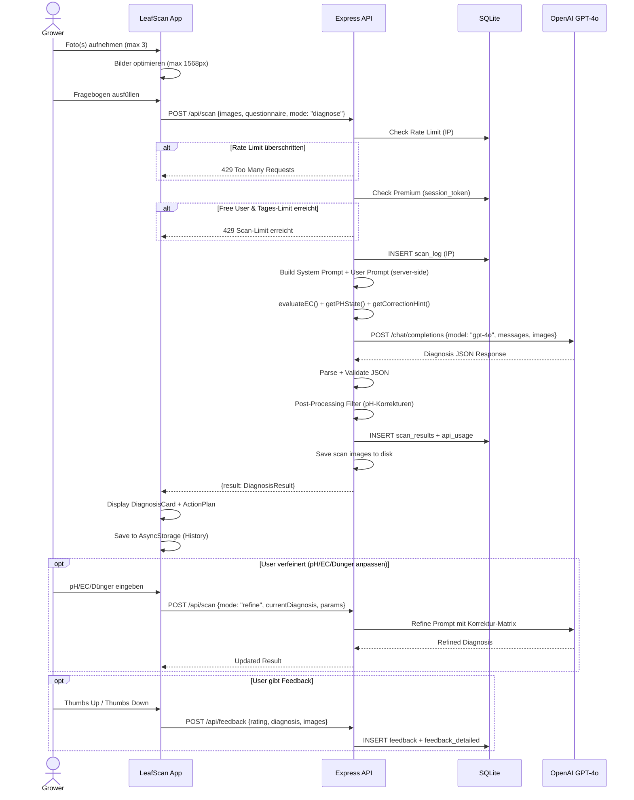

# Sequence Diagram — Diagnose Flow

> Zeigt den vollständigen Ablauf einer Pflanzendiagnose.

```mermaid
sequenceDiagram
    actor User as Grower
    participant App as LeafScan App
    participant API as Express API
    participant DB as SQLite
    participant AI as OpenAI GPT-4o

    User->>App: Foto(s) aufnehmen (max 3)
    App->>App: Bilder optimieren (max 1568px)
    User->>App: Fragebogen ausfüllen
    App->>API: POST /api/scan {images, questionnaire, mode: "diagnose"}

    API->>DB: Check Rate Limit (IP)
    alt Rate Limit überschritten
        API-->>App: 429 Too Many Requests
    end

    API->>DB: Check Premium (session_token)
    alt Free User & Tages-Limit erreicht
        API-->>App: 429 Scan-Limit erreicht
    end

    API->>DB: INSERT scan_log (IP)
    API->>API: Build System Prompt + User Prompt (server-side)
    API->>API: evaluateEC() + getPHState() + getCorrectionHint()
    API->>AI: POST /chat/completions {model: "gpt-4o", messages, images}
    AI-->>API: Diagnosis JSON Response

    API->>API: Parse + Validate JSON
    API->>API: Post-Processing Filter (pH-Korrekturen)
    API->>DB: INSERT scan_results + api_usage
    API->>API: Save scan images to disk

    API-->>App: {result: DiagnosisResult}
    App->>App: Display DiagnosisCard + ActionPlan
    App->>App: Save to AsyncStorage (History)

    opt User verfeinert (pH/EC/Dünger anpassen)
        User->>App: pH/EC/Dünger eingeben
        App->>API: POST /api/scan {mode: "refine", currentDiagnosis, params}
        API->>AI: Refine Prompt mit Korrektur-Matrix
        AI-->>API: Refined Diagnosis
        API-->>App: Updated Result
    end

    opt User gibt Feedback
        User->>App: Thumbs Up / Thumbs Down
        App->>API: POST /api/feedback {rating, diagnosis, images}
        API->>DB: INSERT feedback + feedback_detailed
    end
```
