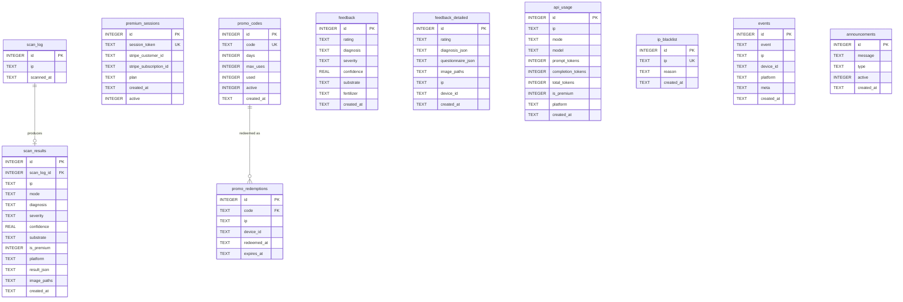

# ER Diagram — LeafScan Database

> SQLite Datenbank mit 11 Tabellen.

```mermaid
erDiagram
    scan_log {
        INTEGER id PK
        TEXT ip
        TEXT scanned_at
    }

    premium_sessions {
        INTEGER id PK
        TEXT session_token UK
        TEXT stripe_customer_id
        TEXT stripe_subscription_id
        TEXT plan
        TEXT created_at
        INTEGER active
    }

    promo_codes {
        INTEGER id PK
        TEXT code UK
        INTEGER days
        INTEGER max_uses
        INTEGER used
        INTEGER active
        TEXT created_at
    }

    promo_redemptions {
        INTEGER id PK
        TEXT code FK
        TEXT ip
        TEXT device_id
        TEXT redeemed_at
        TEXT expires_at
    }

    feedback {
        INTEGER id PK
        TEXT rating
        TEXT diagnosis
        TEXT severity
        REAL confidence
        TEXT substrate
        TEXT fertilizer
        TEXT created_at
    }

    feedback_detailed {
        INTEGER id PK
        TEXT rating
        TEXT diagnosis_json
        TEXT questionnaire_json
        TEXT image_paths
        TEXT ip
        TEXT device_id
        TEXT created_at
    }

    api_usage {
        INTEGER id PK
        TEXT ip
        TEXT mode
        TEXT model
        INTEGER prompt_tokens
        INTEGER completion_tokens
        INTEGER total_tokens
        INTEGER is_premium
        TEXT platform
        TEXT created_at
    }

    ip_blacklist {
        INTEGER id PK
        TEXT ip UK
        TEXT reason
        TEXT created_at
    }

    events {
        INTEGER id PK
        TEXT event
        TEXT ip
        TEXT device_id
        TEXT platform
        TEXT meta
        TEXT created_at
    }

    announcements {
        INTEGER id PK
        TEXT message
        TEXT type
        INTEGER active
        TEXT created_at
    }

    scan_results {
        INTEGER id PK
        INTEGER scan_log_id FK
        TEXT ip
        TEXT mode
        TEXT diagnosis
        TEXT severity
        REAL confidence
        TEXT substrate
        INTEGER is_premium
        TEXT platform
        TEXT result_json
        TEXT image_paths
        TEXT created_at
    }

    promo_codes ||--o{ promo_redemptions : "redeemed as"
    scan_log ||--o| scan_results : "produces"
```
