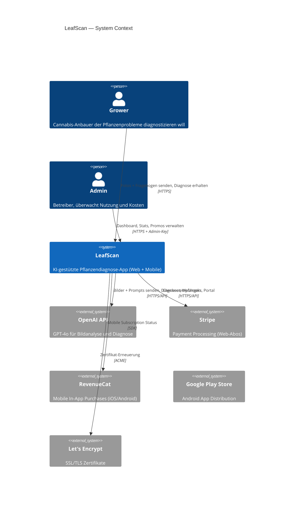

# System Context Diagram (C4 Level 1)

> Zeigt LeafScan und seine externen Abhängigkeiten.

```mermaid
C4Context
    title LeafScan — System Context

    Person(user, "Grower", "Cannabis-Anbauer der Pflanzenprobleme diagnostizieren will")
    Person(admin, "Admin", "Betreiber, überwacht Nutzung und Kosten")

    System(leafscan, "LeafScan", "KI-gestützte Pflanzendiagnose-App (Web + Mobile)")

    System_Ext(openai, "OpenAI API", "GPT-4o für Bildanalyse und Diagnose")
    System_Ext(stripe, "Stripe", "Payment Processing (Web-Abos)")
    System_Ext(revenuecat, "RevenueCat", "Mobile In-App Purchases (iOS/Android)")
    System_Ext(googleplay, "Google Play Store", "Android App Distribution")
    System_Ext(letsencrypt, "Let's Encrypt", "SSL/TLS Zertifikate")

    Rel(user, leafscan, "Fotos + Fragebogen senden, Diagnose erhalten", "HTTPS")
    Rel(admin, leafscan, "Dashboard, Stats, Promos verwalten", "HTTPS + Admin-Key")
    Rel(leafscan, openai, "Bilder + Prompts senden, Diagnose empfangen", "HTTPS/API")
    Rel(leafscan, stripe, "Checkout, Webhooks, Portal", "HTTPS/API")
    Rel(leafscan, revenuecat, "Mobile Subscription Status", "SDK")
    Rel(leafscan, letsencrypt, "Zertifikat-Erneuerung", "ACME")

    UpdateLayoutConfig($c4ShapeInRow="3", $c4BoundaryInRow="1")
```
